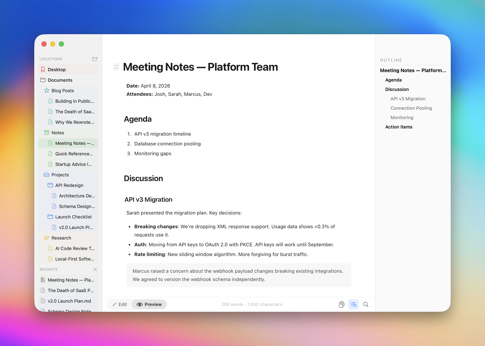

# Clearly Markdown

A clean, native markdown editor for macOS.



## Features

- **Syntax highlighting** — headings, bold, italic, links, code blocks, and more
- **Instant preview** — rendered GitHub Flavored Markdown with Cmd+2
- **Format shortcuts** — Cmd+B, Cmd+I, Cmd+K for bold, italic, and links
- **QuickLook** — preview .md files right in Finder
- **Light & Dark** — follows system appearance or set manually

## Download

Grab the latest DMG from [Releases](https://github.com/Shpigford/clearly/releases/latest) or from [clearly.md](https://clearly.md).

Requires macOS Sonoma (14.0) or later.

## Build from source

```bash
# Install XcodeGen if you don't have it
brew install xcodegen

# Generate the Xcode project and build
xcodegen generate
xcodebuild -scheme Clearly -configuration Debug build
```

## License

MIT — see [LICENSE](LICENSE).
